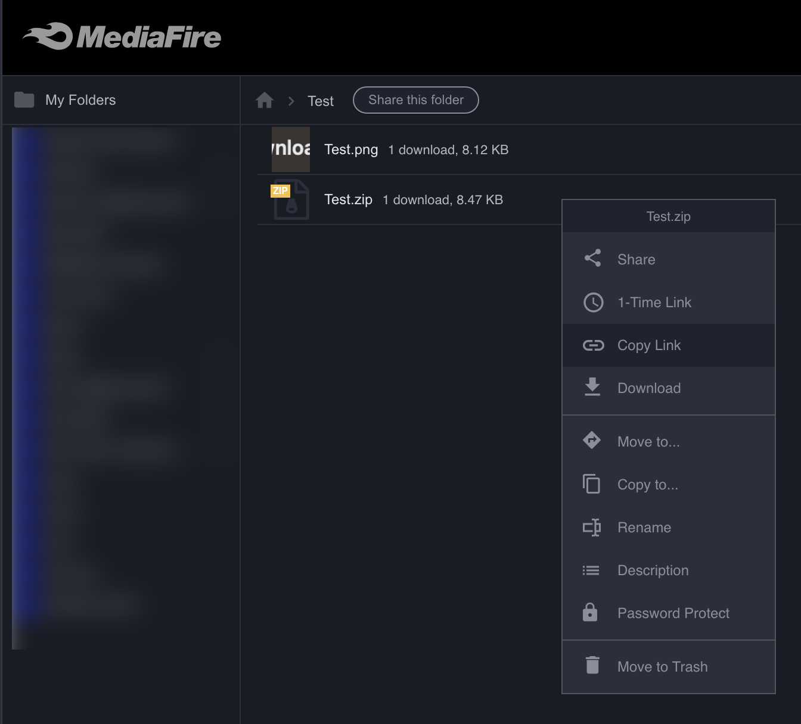
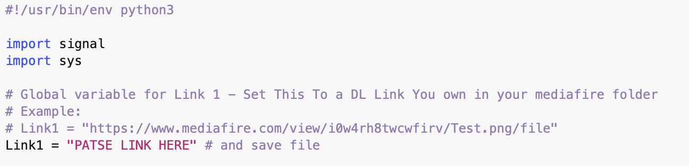

## Scripts

A collection of scripts that edit save files rather than using quickcode.

[Death Stranding](Death%20Stranding)  

> Repairs & Upgrades all Structures on the map, excluding safehouses

[pyconvert](pyconvert.py)  

> A simple script to convert Dec to Hex & vice versa.  
> Supports Floats as well, bring up the help menu to view all options `--help`

**Usage:**  
`python3 pyconvert.py 999 -ui32` will output the hexadecimal value of 999 in 32bit integer (4 bytes) Big Endian by default,  
Apply `--little` if you want it in Little Endian.  
`python3 pyconvert.py 0x000003E7 -ui32` will output the decimal value. All hexadecimal values must start with `0x`.  

[Apollo-lib Compiler macOS](apollo-lib-macos.sh)

> A script for macOS to build and compile Apollo CLI tools
> will handle the Installation of Xcode dev tools & hombrew.
> as well as any other necessary dependcies.

**Usage**  
open a temrinal window type in `chmod 755` then a space, then drag the script on the window & hit enter.  
now right click on the `apollo-lib-macos.sh` script & open with Terminal.

[MediaFire](MediaFire.py)  

> A Script that bypasse's the blocked/dangerous links that you cannot download on mediafire.  
> you must be logged in with mediafire 1st & have a dummy file uploaded to your own mediafire drive,  
> use that dummy file to set the varrible for `Link1`.

**Usage:**  
`python3 MediaFire.py` it will then ask you to enter the link you are trying to access,  
enter the link & hit enter, it should give you an example link like this `mediafire.com/?i0w4rh8twcwfirv,b1wt1l2hrb0ey3e`  
as the output.

