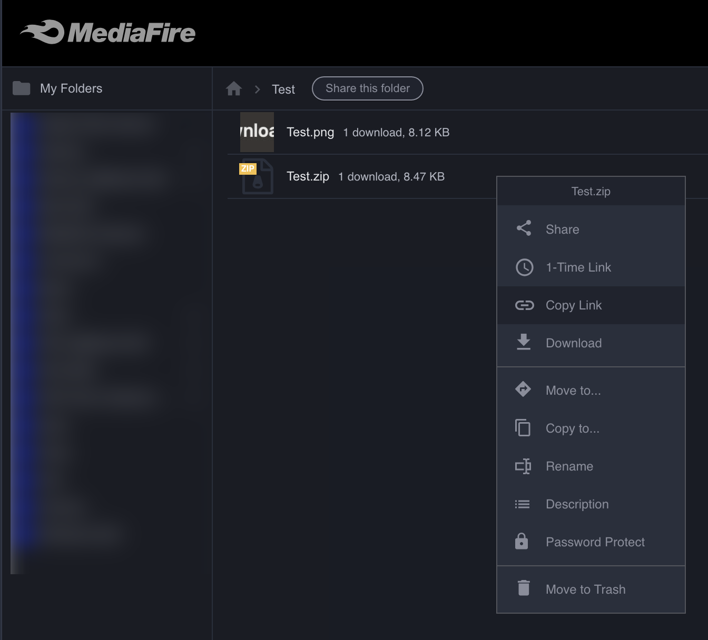
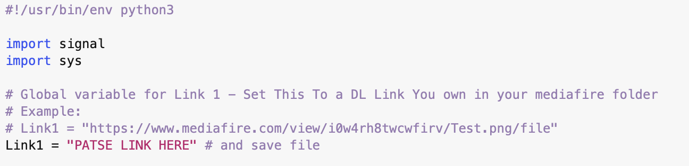

## Scripts

A collection of scripts that edit save files rather than using quickcode.

[Death Stranding](Death%20Stranding)  

> Repairs & Upgrades all Structures on the map, excluding safehouses  
> Maxes out your owned safehouses resources

[pyconvert](pyconvert.py)  

> A simple script to convert Dec to Hex & vice versa.  
> Supports Floats as well, bring up the help menu to view all options `--help`

**Usage:**  
`python3 pyconvert.py 999 -ui32` will output the hexadecimal value of 999 in 32bit integer (4 bytes) Big Endian by default,  
Apply `--little` if you want it in Little Endian.  
`python3 pyconvert.py 0x000003E7 -ui32` will output the decimal value. All hexadecimal values must start with `0x` when converting back to decimal.  
`python3 pyconvet.py C39E943977124BE8 -swp` will swap endianness of the inputed hexadecimal input.

[Apollo-lib Compiler macOS](apollo-lib-macos.zsh)

> Builds Apollo CLI tools (`patcher`, `dumper`) and the macOS GUI app (`apollo_patcher_gui.app`).
> Checks/installs Xcode CLT, Homebrew, CMake, and zlib; then bootstraps the workflow-selected mbedTLS tarball. The upstream GUI requires CMake 3.16 or newer.
> GUI CMake configuration fetches Dear ImGui/GLFW, so network access and Git are required.
> `patcher` handles both endianness modes; use `-b/--big-endian` at runtime. No `patcher-bigendian` artifact is produced.
> All three artifacts land together in `~/Desktop/Apollo CLI Tools`; override that destination for one run with `STORE_PATH`.
> On macOS, no extra GUI package install is required (Cocoa/OpenGL/osascript are OS-provided).

**Usage**  
open a terminal and run `chmod 755` on the script, or right-click the script and open with Terminal.

[MediaFire](MediaFire.py)  

> A Script that bypasse's the blocked/dangerous links that you cannot download on mediafire.  
> you must be logged in with mediafire 1st & have a dummy file uploaded to your own mediafire drive,  
> use that dummy file to set the varrible for `Link1`.

**Usage:**  
`python3 MediaFire.py` it will then ask you to enter the link you are trying to access,  
enter the link & hit enter, it should give you an example link like this `mediafire.com/?i0w4rh8twcwfirv,znig9z0dsbg6x7k`  
as the output.

  

you should be able to see one of your files & the block file, then you just right click on the file that is blocked (red tint), click on "Copy File To" & place it in your own drive, from there you can download the blocked file as you own it now.
